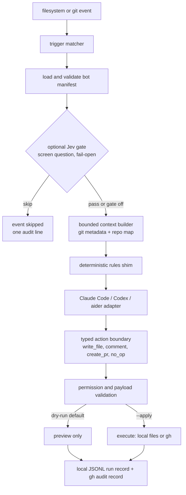

# Architecture

## Product model

forgebot turns a git repository into a small operating environment for named bots. A bot is a versioned Markdown manifest containing instructions, triggers, and permissions. The kernel depends only on `typer`, `pyyaml`, and `watchdog`; model work is delegated to an agent CLI the user already runs.

## Runtime flow

## Components

- `manifest.py`: parses human-readable bot definitions and validates permissions.
- `watcher.py`: converts file changes and git hooks into trigger events.
- `jev.py`: optional fail-open gatekeeper; screens events before any agent run.
- `context.py`: creates bounded reproducible context; it must never silently upload a whole repository.
- `repomap.py`: extracts a compact Python symbol outline.
- `backends.py`: delegates model interaction to an installed agent CLI.
- `github.py`: runs the official `gh` CLI as argv lists for comment and PR actions.
- `actions.py`: the boundary between model output and external side effects.
- `engine.py`: coordinates the flow and records runs.

## Trust boundaries

1. **Repository → manifest:** a repository can contain malicious bot instructions. Treat manifests as code, review them before execution.
2. **Manifest → backend:** permissions and backend selection must be explicit. Do not pass write-capable tools to read-only bots.
3. **Model → action executor:** model prose must never directly execute an external write. Parse and validate typed actions first.
4. **GitHub → local runner:** future webhooks require signature validation, replay protection, least-privilege tokens, and idempotency keys.
5. **forgebot → GitHub:** write actions go through the user's own `gh` login. forgebot never reads or stores the token; `gh` owns authentication, and forgebot passes argument lists only.
6. **forgebot → TypeSafe AI (optional Jev gate):** disabled unless `TYPESAFE_API_KEY` is set. When enabled, the only outbound data is the bot's `screen:` question and the trigger text. The gate is fail-open by design; it saves agent tokens and is not a security boundary.

## Design rule

Keep the kernel understandable without a framework. Add infrastructure only when it removes a demonstrated source of complexity.
