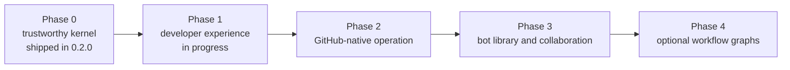

# Roadmap

The goal is not to make a large AI wrapper. The goal is to make bots portable, reviewable, and genuinely useful in real repositories.

## Status (2026-09-29)

0.2.0 ships the trustworthy kernel plus real GitHub write actions (`comment`, `create_pr` via `gh`), the optional Jev gatekeeper, and the aider `--dry-run` hardening. The Textual TUI and the plugin architecture are deferred to 0.3.0.

## Phase 0 — trustworthy kernel (shipped in 0.2.0)

- Stable bot manifest schema.
- Trigger matching for git hooks and file events.
- Permission validation and typed action boundary.
- Bounded repo context and local run history.
- Unit tests, CI, security policy, and clear examples.

## Phase 1 — useful developer experience (in progress)

- `forgebot install owner/repo/path` for bot packages. (planned)
- `forgebot validate` and `forgebot doctor`. (`doctor` shipped in 0.2.0; `validate` planned)
- More language-aware repo maps using tree-sitter behind an optional extra. (planned)
- Dry-run mode and approval mode for every write action. (shipped in 0.2.0)
- Structured JSON event logs. (shipped in 0.2.0)

## Phase 2 — GitHub-native operation

- `comment` and `create_pr` actions through the user's own `gh` login. (shipped in 0.2.0)
- GitHub App and webhook receiver. (planned)
- HMAC signature checks, replay protection, idempotency, and least-privilege installation permissions.
- Pull-request review bot, release-notes bot, stale-doc bot, and CI triage bot.
- SQLite or Postgres run history.

## Phase 3 — bot library and collaboration

- Public bot registry based on git repositories.
- Manifest validation in CI.
- Compatibility metadata for backends and permissions.
- Ratings, examples, install counts, and reproducible demos.
- Bot version pinning and lockfiles.

## Phase 4 — optional workflow graphs

Only after real usage demonstrates the need: retries, approval nodes, fan-out/fan-in, scheduled jobs, and durable state. At that point evaluate a graph runtime such as LangGraph against a small native state machine.

## 0.3.0 candidate scope

- A real dashboard for runs, actions, and permission events (deferred from 0.2.0, where only a stub existed).
- Plugin architecture for backends and action kinds.
- `forgebot validate` and `forgebot install`.

## North-star metrics

- Time from clone to first successful bot run.
- Percentage of runs that finish without manual repair.
- Permission-denial rate and unsafe-action prevention.
- Repeat usage per repository.
- Number of external contributors and accepted bot packages.
- Stars are a lagging signal; user success and retention come first.
