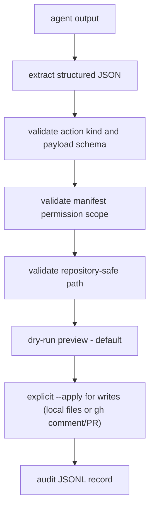

# Security model

forgebot executes software-adjacent automation, so convenience must not outrun trust boundaries.

## Action execution flow

The default is dry-run. Model output never directly performs a write. Only supported typed actions can reach the executor.

## Threats

- Prompt injection in README files, issues, source code, or generated artifacts.
- A malicious bot manifest requesting broad write permissions.
- Agent CLI escape through shell commands or inherited credentials.
- A bot leaking environment variables into comments or pull requests.
- Spoofed GitHub webhooks or replayed events.
- A dependency or GitHub Action compromise.

## Required controls

- Review manifests before enabling them.
- Default new bots to read-only and require explicit approval for writes.
- Keep credentials out of prompts and repository context.
- Bound context size and exclude `.env`, keys, tokens, and ignored secrets.
- Use dry-run mode before write mode.
- Make action execution typed, logged, idempotent, and permission-checked.
- Validate GitHub webhook signatures and reject replays.
- Keep GitHub Actions permissions minimal and dependencies updated.

## GitHub writes via gh

- `write:comments` and `write:pr` actions run through the official `gh` CLI as argument lists — never a shell string — so payloads cannot smuggle extra commands.
- forgebot never reads your GitHub token. Authentication belongs to `gh auth login`; forgebot inherits whatever repository access the user already granted `gh`.
- Dry-run prints the exact argv that would run. Comment and PR bodies are redacted in `.gitbot/state/actions.jsonl`.
- If `gh` is missing or unauthenticated, `--apply` fails loudly with install and login instructions.

## Jev gate data flow

- Off by default. With no `TYPESAFE_API_KEY`, no data leaves the machine for screening.
- When enabled, the only data sent to TypeSafe AI is the bot's `screen:` question and the trigger text (for example `file_added(runs/7/metrics.json)`). Repository context is sent only if you write it into the question.
- The gate is fail-open by design: it saves agent tokens, it is not a security boundary. Gate errors proceed with the run and log a warning.

## Aider residual risk

The aider backend runs with `--dry-run`, so the model cannot modify working-tree files. Aider may still write its own chat-history and log files, and its output is not sandboxed like Codex's. forgebot never auto-selects aider for `--apply` runs; choosing it explicitly prints a warning.

## Local state and audit data

- `.gitbot/state/actions.jsonl` is the append-only audit trail: one line per validated action, with comment and PR bodies replaced by a `<N chars>` placeholder.
- `.gitbot/state/runs.jsonl` records each run, including an agent output excerpt (first 4000 characters) and the executed action entries with their exact argv — raw comment and PR bodies included. Treat the whole state directory as sensitive data.
- Add `.gitbot/state/` to your `.gitignore` so run and audit data never reaches a commit; forgebot itself never writes inside `.git`.
- `forgebot run` (watcher) and `forgebot hook` (git hook shims) are always dry-run. They never execute write actions, even when a bot declares write scopes. Writes require an explicit `forgebot run-once --apply`.

## Safe rollout

1. Local read-only mode.
2. Local write mode with user approval.
3. Pull-request-only writes.
4. GitHub App with repository-scoped permissions.
5. Fully automated writes only for narrowly bounded actions.
